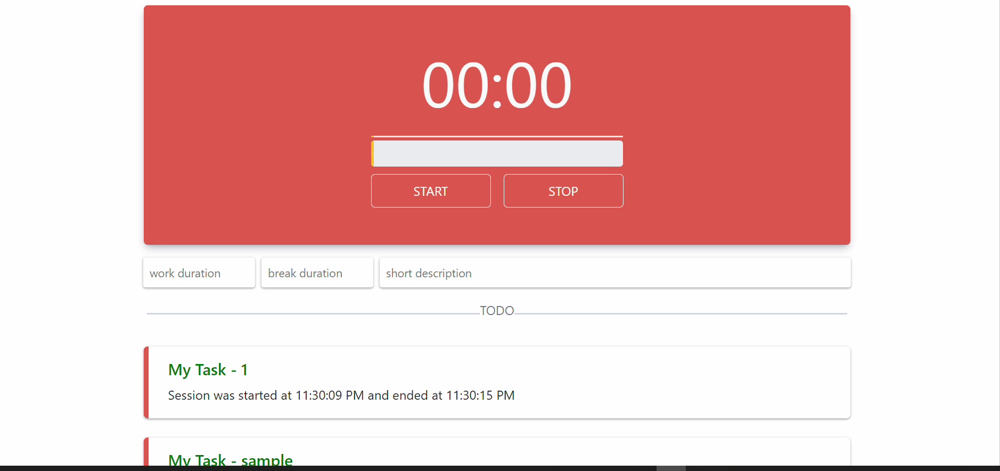

# Pomodoro-Timer

## A simple and clean pomodoro timer app that helps you focus on your daily timely tasks
-------------------------------------------------
#### Visit the app by clicking this [Pomodoro Timer](https://pomodorotimer1213.netlify.app/)




#### Just go to `timer.js` to add more fucntionalites to the app and make it more wonderfull

#### Feel free to change or customize as much as you want

#### It sound awesome if you have a much better ideas to improve this

#### Do contribute and share your ideas with all other developers so that they can take advantage of your customization

Table of Content
================

* * * * *
-   [Getting started](#)
-   [How to get files](#)
-   [Change and Customization](#)
-   [How this app's code helps you](#)
-   [Deployment](#)


Getting Started
===============

* * * * *

These instructions will get you a copy of the project up and running on
your local machine for development and testing purposes

First you will need to install [Git](https://git-scm.com/downloads) and [Node.js](https://nodejs.org/en/download/) on your local machine/computer.

How to get files
================

* * * * *

When you have done with installation!

Go to your required directory, and open GIT command line by right clicking on the screen and select 'GIT BASH HERE'

then you get a command line interface

put command to clone the files on your local computer
```git
\$ git clone https://github.com/fahadhassan1213/ToDo-Tasks-app.git
```
**** 

Change and Customization
========================

* * * * *

You can change the `timer.js` file to addd more functionalities to the app

In the code given below the is for updating the values of input every time the user change the value in any input box
```js
descForm.workTime.addEventListener('keyup',e=>{
    errorMessage.classList.add('d-none')
    workDuration = e.target.value;
    workMinutes = workDuration - 1;
    timeRatio_of_progress = ((workDuration * 60)/100) * 1000;
   
})
descForm.breakTime.addEventListener('keyup',e=>{  
    errorMessage.classList.add('d-none')
    breakDuration = e.target.value;
    breakMinutes = breakDuration - 1;

})
descForm.shortDesc.addEventListener('keyup',e=>{
    errorMessage.classList.add('d-none')
    shortDesc = e.target.value;    
})

```
following is the code of operations performing on each button 

On **start** button firstly we have to check that either any of the input field is empty or not
if the any of the input field will be empty then we show an error message to the user
Here we are also storing the _current time_ which is the starting time of the session
```js
myBtns.addEventListener('click',(e)=>{
    if(e.target.classList.contains('start')){
        if(workDuration !== '0' && workDuration !==''){
            if(breakDuration !== '0' && breakDuration !== ''){
                if(shortDesc !== ''){
                    myIntervals();
                    disabling();
                    console.log(1)
                    myBtns.children[1].classList.remove('d-none')
                    myBtns.children[2].classList.add('d-none')
                    const checkCurrtime = new Date();
                    currentTime = checkCurrtime.toLocaleTimeString();
                }
                else{
                errorMessage.classList.remove('d-none')
                }
            }
            else{
            errorMessage.classList.remove('d-none')
            }
        }
        else{
            errorMessage.classList.remove('d-none')
        }
```
On other (pause,resume,stop) buttons we are performing basic operation as if we click on the _pause button_
\
it will cause the _pause button_ to hide and show the _resume button_ same is the operation with _resume button_
```js
        }
    else if(e.target.classList.contains('pause')){
        clearInterval(timer1);
        clearInterval(timer2)
        myBtns.children[1].classList.add('d-none')
        myBtns.children[0].classList.remove('d-none')
    }
    else if(e.target.classList.contains('resume')){
        myIntervals();
        myBtns.children[0].classList.add('d-none')
        myBtns.children[1].classList.remove('d-none')
    }
```
On _stop button_ we are storing the end time of the session and rendring the task and session time detail on the screen
```js    
    else if(e.target.classList.contains('stop')){
        myBtns.children[0].classList.add('d-none')
        myBtns.children[1].classList.add('d-none')
        myBtns.children[2].classList.remove('d-none')

        const checkEndtime = new Date();
        EndTime = checkEndtime.toLocaleTimeString();

        let html = `
        <div class="item my-4">
            <h5 class="px-4 mb-2 pt-3" style="color: green;">${shortDesc}</h5>
            <p class="px-4 fw-normal">${sessionTime()}</p>
        </div>     `
        completed.innerHTML += html
        clearAll();
    }

})

```
Code given below is performing time decreasing operation

The _Work minutes_ and the _Break minutes_ are the _Work Duration_ and the _Break Duration_ which we get from user 

On each call of this function we are decreasing seconds and minutes respectively 

Every time the work duration become over 'workMinutes === -1' we start the break session and 
respectively and when the break session will over we again started the work session
```js

//fucntion, which is for showing the remaining time to user
let timeReamaining = () =>{
    seconds = seconds - 1;
    if(seconds === 0){
        workMinutes = workMinutes - 1;
        if(workMinutes === -1){
            if(breakcount % 2 === 0){
                workMinutes = breakMinutes;
                breakcount = breakcount + 1;
                notice.innerText = `(Break Time)` 
    
            }else{
                width = 1;
                workMinutes = workDuration - 1;
                breakcount = breakcount + 1;
                notice.innerText = ' ';

        } 
    }
        seconds = 59;
    }
```

Code given below is for progress bar, to increase on every call to the fuction 
```js
const progressBar1 = document.querySelector('.p1')
const progressBar2 = document.querySelector('.p2')
let increaseProgress = () =>{
    if(width === 100){
        progressBar1.style.width = 1 + '%'
        progressBar2.style.width = 1 + '%'
    }else{
        width ++;
        progressBar1.style.width = width + '%';
        progressBar2.style.width = width + '%';
    
    }
    
}

```
At the End when the session will be stoped we have to clear all the inputs and the session itself
So for this purpose we do clear and reset all the variables we want to be cleared as shown below

```js
let clearAll = () =>{
    enabling();
    clearInterval(timer1)
    clearInterval(timer2)
    workMinutes = workDuration - 1;
    seconds = 60;
    breakMinutes = breakDuration - 1;
    shortDesc = ''
    progressBar1.style.width = 1 + '%'
    progressBar2.style.width = 1 + '%'
    remTime.textContent = `00:00`
    notice.textContent = '';
    width = 1

}

//fuction to show the starting and ending time 
let sessionTime = () =>{
    return `Session was started at ${currentTime} and ended at ${EndTime}`
}

```
above last `sessionTime` function is for rendring the _current and End_ time of session to the screen

How this app's code helps you
========================
In the `time.js` file you can get the javascript code 

Using the code you can be able to creat a pomodoro timer in which you can allow the
user to set a session time in which user is needed to provide work duration and break duration 
and the short description about the task

You have to just check the working of code and apply this code in your project and make your projects more awesome

Deployment
========================
When you have done with the setup you should host your site online

You can use [NETLIFY](https://www.netlify.com/) for deployment of your

for more information please read [hosting on Netlify](https://create-react-app.dev/docs/deployment/#netlify)

